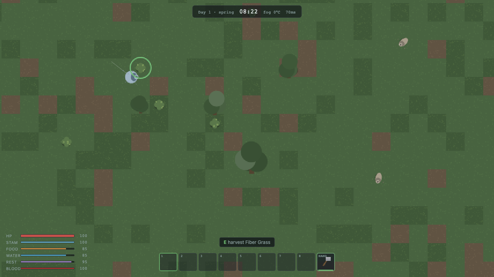
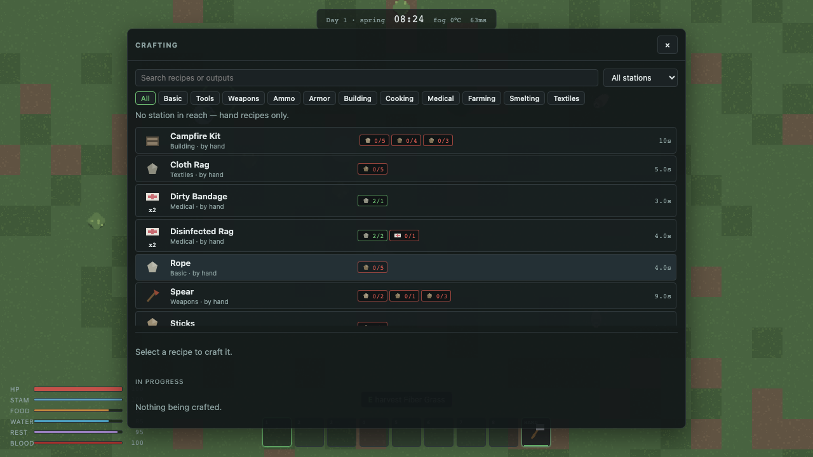
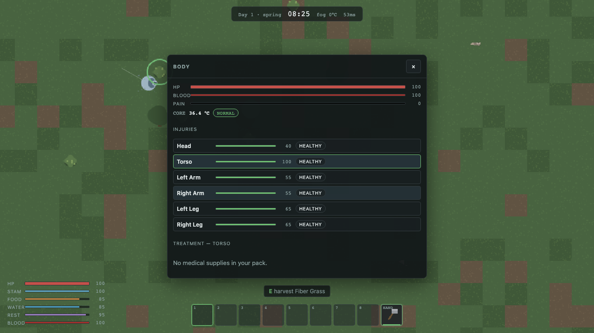
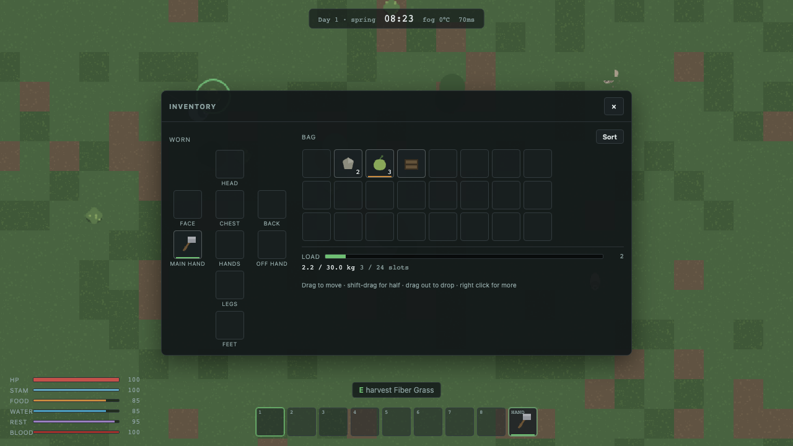
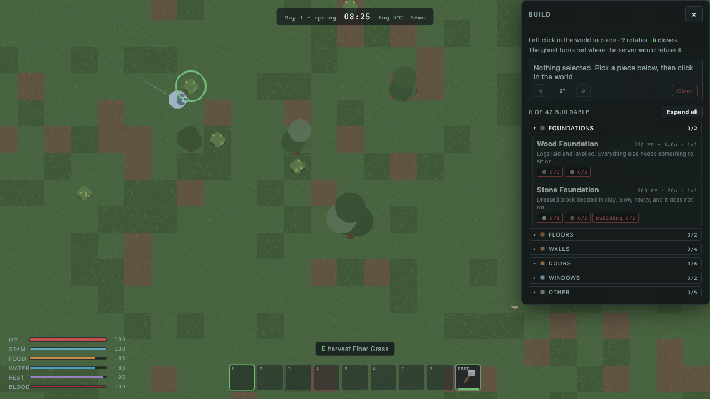

# Survive

A top-down survival game: scavenge, gather, farm, craft, build, and fight what the
night sends at you. Phaser 4 client, authoritative Node simulation, one server binary
for both single-player and multiplayer.

The design principle everything else follows from:

> **Single-player and multiplayer do not use different game logic.**
> Single-player runs the same authoritative server on `127.0.0.1` with one client
> connected to it.

## Quick start

```bash
npm install
```

Run a dedicated server and the web client side by side:

```bash
npm run dev
```

Then open the client (Vite prints the URL, usually <http://localhost:5173>) and
connect to `ws://127.0.0.1:27500`.

Server only:

```bash
npm run start:server -- --mode dedicated --bind 0.0.0.0 --port 27500 --save world01 --maxPlayers 16
```

Single-player, which is the same binary bound to loopback with a one-shot token:

```bash
npm run start:server -- --mode singleplayer --bind 127.0.0.1 --save world01
```



## What is in the game

| System      | What it covers                                                                    |
| ----------- | --------------------------------------------------------------------------------- |
| Survival    | Hunger, thirst, fatigue, stamina, body temperature, blood volume                  |
| Injury      | Six body parts, bleeding, fractures, burns, bites, wound infection, treatment     |
| Combat      | Melee arcs, ranged ballistics, armour by body part, crits, blocking, knockback    |
| Gathering   | Trees, rock, ore, clay, bushes, herbs, scrap, water — tool tiers and yields       |
| Farming     | Tilling, planting, watering, fertilising, growth stages, blight, harvest, seasons |
| Crafting    | Hand crafting plus workbench, furnace, anvil, loom, campfire, chemistry stations  |
| Building    | Foundations, walls, doors, windows, floors, storage, stations, traps, lighting    |
| Enemies     | Zombie AI with LOD tiers, senses, hordes, noise propagation; wildlife to hunt     |
| World       | Chunked terrain, biomes, roads, towns with lootable buildings, day/night, weather |
| Progression | Twelve skills that feed back into damage, yields, craft speed and stamina         |
| Multiplayer | Area-of-interest replication, client prediction, server reconciliation            |
| Persistence | Chunk-based dynamic world saves, portable between single-player and dedicated     |

## Architecture

```
                    Shared packages
        ┌───────────────────────────────────────┐
        │ protocol · game-data · world          │
        │ simulation · persistence · netcode    │
        └───────────────┬───────────────────────┘
                        │
        ┌───────────────┴───────────────┐
   Game Server                     Game Client
   Node + Colyseus                  Phaser 4
   authoritative simulation         rendering, input
   persistence, AI, world           UI, audio, prediction
```

Phaser is not the owner of game logic. It renders state the server sends and turns
key presses into intents. A player is a plain data record, not a sprite:

```ts
interface PlayerState {
  id: string;
  x: number;
  y: number;
  health: number;
  hunger: number;
  thirst: number;
  fatigue: number;
  inventory: InventoryState;
  equipment: EquipmentState;
  body: BodyState;
  // ...
}
```

The server decides everything that matters. A client never reports outcomes:

```
client: "I pressed attack, aim 37°, axe equipped"
server: weapon → cooldown → stamina → reach → collision → hit → damage → state
```

### Layout

```
apps/
  client/           Phaser 4 + Vite renderer
  desktop/          Electron shell; spawns the local server for single-player
  server/           the GameServer: Colyseus rooms, AOI, persistence, CLI
  server-launcher/  Electron GUI that supervises a dedicated server process
packages/
  protocol/         state, commands, events, wire messages, seeded RNG, fixed clock
  game-data/        items, recipes, structures, nodes, crops, creatures, loot tables
  world/            terrain generation, collision grid, line of sight, pathfinding
  simulation/       every game rule, as fixed-tick systems over plain state
  persistence/      WorldRepository plus filesystem, SQLite and in-memory backends
  netcode/          connection, input prediction, reconciliation, interpolation
  test-utils/       headless harness, world fixtures, bot clients
tests/              unit · integration · multiplayer · gameplay · visual
tools/              development and content utilities
```

### Runtime shapes

```
Single player                    Dedicated
─────────────                    ─────────
Game.exe                         ServerLauncher.exe
 ├─ Electron ─ Phaser client      └─ GameServer.exe
 └─ child_process
      └─ GameServer  ← 127.0.0.1        clients ← LAN/Internet
```

Same executable, same save format, same simulation. Only configuration differs, so a
single-player world folder can be dropped onto a dedicated server and played as-is.

## Scripts

| Command                    | Purpose                                            |
| -------------------------- | -------------------------------------------------- |
| `npm run dev`              | Server and client together, watched                |
| `npm run typecheck`        | Whole-repo TypeScript check                        |
| `npm run lint`             | ESLint, including the determinism rules            |
| `npm test`                 | Vitest: unit, integration and multiplayer projects |
| `npm run test:unit`        | Fast headless simulation and pure-logic tests      |
| `npm run test:multiplayer` | Real server, multiple bot clients                  |
| `npm run test:gameplay`    | Playwright against the real Phaser client          |
| `npm run build`            | Production client bundle and server bundle         |
| `npm run check`            | format + lint + typecheck + test                   |

## Screenshots

Regenerated by the gameplay suite rather than kept by hand — `npm run test:gameplay`
rewrites `docs/screenshots/`, so they cannot drift from what the game actually looks like.

|                                                                              |                                                                      |
| ---------------------------------------------------------------------------- | -------------------------------------------------------------------- |
|                                 |                                 |
| Crafting: 107 recipes, filtered by category and by which station is in reach | Injuries: six body parts, bleeding, fractures, infection, treatment  |
|                               |                               |
| Inventory and equipment, drag and drop between any two containers            | Building: 47 structures, costs checked against what you are carrying |

## Testing philosophy

The simulation is headless and fixed-tick, so most tests need neither a browser nor a
socket nor real time:

```ts
const sim = createTestSimulation({ seed: 1234 });
const player = sim.addTestPlayer();
sim.step(SIM_HZ * 60 * 10); // ten in-game minutes, instantly
expect(player.thirst).toBeGreaterThan(0);
```

Integration tests stand up the real server with an in-memory repository; multiplayer
tests connect several bot clients and assert that all of them converge on the same
authoritative state; Playwright drives the actual Phaser client for input, combat and
UI checks.

## Contributing

Read [AGENTS.md](AGENTS.md) first. It lists the architecture rules that keep
single-player and multiplayer identical, the simulation deterministic, and the test
suite fast.
